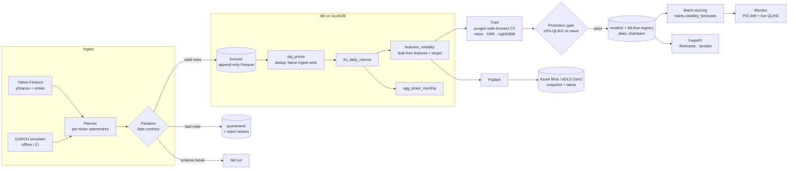

# Market Data Lakehouse & Volatility Forecasting

An end-to-end data + ML platform built on daily equity market data. It ingests prices
incrementally, checks them against data contracts, models them into a tested dbt/DuckDB
warehouse, and trains and gates a volatility-forecasting model tracked in MLflow. The
model is served through FastAPI, monitored for drift and live accuracy, and the gold
layer is published to Azure. It runs on a schedule and ships with Docker, CI, and Terraform.

```
Yahoo Finance ─▶ contracts ─▶ bronze (Parquet) ─▶ dbt/DuckDB (staging ▶ marts) ─▶ LightGBM ─▶ FastAPI
                     │                                    │                          │
                quarantine                          19 data tests            MLflow registry ─▶ Azure Blob
```

## Results (real data, 20 tickers, 2015–2026)

The model forecasts **annualised realised volatility over the next 5 trading sessions**.
It is evaluated with 5-fold *purged* walk-forward CV, where each fold is one full
out-of-sample year (5,040 forecasts per fold).

| Model | QLIKE ↓ | RMSE (log vol) ↓ | R² (log vol) | vs. naive (QLIKE) | Folds won |
|---|---|---|---|---|---|
| Naive persistence (21-day RV) | 0.514 | 0.547 | 0.10 | — | 0 / 5 |
| HAR-RV (Corsi 2009) | 0.463 | 0.509 | 0.22 | −10.0% | 0 / 5 |
| **LightGBM** (promoted) | **0.435** | **0.498** | **0.25** | **−15.5%** | **5 / 5** |

LightGBM beats the naive baseline *and* the standard econometric benchmark (HAR-RV) in
every test year from 2021–22 through 2025–26. The Parkinson high–low range estimators
carry ~77% of the model's gain importance. That matches the literature: range-based
estimators use intraday information that close-to-close returns throw away.

> Numbers come from `models/model_card.json` and the MLflow run. Re-running
> `make pipeline` reproduces them on current data.

## Architecture



Orchestration: Prefect flows (daily run after the US close plus a Saturday retrain),
the same steps as a GitHub Actions schedule, or just `market-pipeline run`.

## Quickstart

Requires [uv](https://docs.astral.sh/uv/) (Python 3.12 is installed automatically).

```bash
make install        # uv sync --all-extras
make demo           # full pipeline offline on simulated data (~30s)
make pipeline       # full pipeline on real Yahoo Finance data
make serve          # API on http://localhost:8000/docs
make mlflow         # experiment tracking UI on http://localhost:5000
make test           # 40 tests: unit, dbt, ML, API, publishing
```

Or run the whole stack in containers: pipeline, API, MLflow UI, and the Azurite Azure emulator:

```bash
docker compose up --build
curl localhost:8000/forecasts/NVDA
```

Each stage can also be run on its own:

```bash
market-pipeline ingest [--source synthetic]   # extract -> validate -> bronze
market-pipeline transform                     # dbt source freshness + dbt build
market-pipeline train                         # CV, gate, promote, log to MLflow
market-pipeline predict                       # score latest session per ticker
market-pipeline monitor --fail-on-alert       # drift + live accuracy
market-pipeline publish                       # gold tables -> Azure Blob
```

## How it works

### 1. Ingestion ([`ingest.py`](src/market_pipeline/ingest.py), [`sources/`](src/market_pipeline/sources/))
- **Incremental.** Each ticker's watermark (its latest landed date) is read from bronze.
  Known tickers re-fetch only `watermark − lookback_days`, so late vendor corrections are
  still picked up. New tickers backfill from `start_date`. Tickers that share a start date
  are batched into one vendor call.
- **Resilient.** Exponential-backoff retries (tenacity) on empty or failed downloads. A
  missing ticker is logged and skipped rather than failing the batch.
- **Pluggable sources.** A `MarketDataSource` protocol with a Yahoo implementation and a
  deterministic GARCH(1,1) simulator. The simulator gives the same bars for any date
  window, which makes incremental logic testable offline.
- **Run manifests.** Every run writes `data/_runs/<run_id>.json` with row counts,
  fetch windows, and timings, for lineage and debugging.

### 2. Data contracts ([`schemas.py`](src/market_pipeline/schemas.py))
Pandera checks types, positivity, OHLC consistency (`low ≤ open, close ≤ high`), key
uniqueness, and dates not in the future. Failures are handled in two ways:
- **Row-level** violations go to `quarantine/` with a machine-readable reason, and the
  run continues. On the first real run this caught Yahoo's *in-progress* session bars
  (`close = NaN` during market hours) for all 20 tickers. The next run's lookback
  re-fetches them once they're final.
- **Schema-level** violations (a missing column, the wrong type) fail the run, because an
  upstream contract change should never flow silently into the warehouse.

### 3. Lakehouse modelling ([`dbt/`](dbt/))
- **Bronze is append-only**. Each run writes a new immutable Parquet file. `stg_prices`
  deduplicates with `qualify row_number() … order by ingested_at desc`, which makes
  re-runs **idempotent** while keeping a full audit trail.
- `features_volatility` builds trailing realised vol (5/21/63-day), Parkinson range vol,
  momentum, volume z-scores, and a cross-sectional market-vol feature, all with SQL
  window functions. The target uses a *forward* frame (`rows between 1 following and 5 following`).
- **19 data tests**: key uniqueness, not-null, value ranges, OHLC consistency, source
  freshness (`loaded_at_field: ingested_at`), plus a **target-leakage test** that proves
  `target(t) == rv_5d(t+5)`. A pytest test also recomputes the features in pandas and
  checks they match the SQL output exactly.

### 4. Modelling ([`ml/`](src/market_pipeline/ml/))
- **Purged walk-forward CV.** Expanding training windows, one-year test blocks, and an
  embargo of `horizon` sessions between train and test. Without the embargo, the last
  training labels (which look 5 days ahead) would overlap the test period and leak.
- **Model selection on QLIKE** ([Patton 2011](https://doi.org/10.1016/j.jeconom.2010.03.034)),
  the standard robust loss for volatility forecasts, with RMSE/MAE/R² reported alongside.
- **Bias correction.** Models are fit on log-vol, and exp(E[log σ]) under-predicts
  variance (Jensen's inequality). An early run showed this: on QLIKE the naive baseline
  beat HAR even though HAR's RMSE was 7% better. Every candidate, the baseline included,
  is now wrapped in a **Duan smearing estimator** calibrated on a time-ordered holdout.
- **Promotion gate.** The champion is promoted only if it beats naive persistence by
  ≥5% QLIKE. Otherwise the current production model stays in place.
- **MLflow.** Parameters, per-fold metrics, out-of-sample predictions, feature importance,
  and the model card are logged for every run. Promoted models are registered as
  `volatility-forecaster@champion` using skops serialisation (no arbitrary pickle).

### 5. Serving & monitoring ([`api/app.py`](src/market_pipeline/api/app.py), [`monitor.py`](src/market_pipeline/monitor.py))
- **FastAPI**: `GET /forecasts`, `GET /forecasts/{ticker}`, `POST /predict` (validated
  feature vector), `GET /model` (model card), `GET /health`. It returns 503 when no model
  is promoted or the warehouse is locked, and 404 for unknown tickers.
- **Batch scoring** is an idempotent upsert into `marts.volatility_forecasts`, and flags
  tickers whose inputs are stale.
- **Drift (PSI)** is computed against a reference profile stored in the model card. Drift
  in volatility-*level* features is reported but doesn't affect health: vol regimes
  always shift, and adapting to them is the model's job. Health is set by drift in
  scale-free features, which points to a data issue, and by **live QLIKE** on forecasts
  whose outcomes are now known. The Prefect flow retrains the same day if health fails.

### 6. Publishing & infrastructure
- Gold tables are exported as ZSTD Parquet and uploaded to Azure Blob as
  `snapshot_date=YYYY-MM-DD/` plus `latest/`. This is tested against a fake client and,
  in CI, against the **Azurite** emulator.
- [`infra/azure`](infra/azure/): Terraform for an ADLS Gen2 account with a private
  container, TLS 1.2, soft delete, and a lifecycle policy that moves snapshots to the
  cool tier after 30 days.

## Engineering practices

| Area | What's in place |
|---|---|
| Testing | 40 pytest tests (83% coverage) plus 19 dbt data tests. The full lakehouse is built once per session from the simulator, so CI never touches the network |
| CI/CD | GitHub Actions: ruff, format check, mypy with pandas-stubs, `dbt parse`, pytest with an Azurite service container, Docker build |
| Scheduling | `pipeline.yml` (weekday runs, Saturday retrain, monitoring gate, report artifacts), or Prefect deployments |
| Config | Typed pydantic-settings: YAML, overridden by `MP_*` env vars (e.g. `MP_ML__HORIZON_DAYS=10`). Secrets are `SecretStr` |
| Packaging | uv lockfile, non-root Docker image with cached dependency layers, `docker compose` stack |

## Project layout

```
├── config/pipeline.yaml        # tickers, dates, ML + Azure settings
├── src/market_pipeline/
│   ├── sources/                # Yahoo + GARCH simulator behind one protocol
│   ├── schemas.py              # Pandera data contract + quarantine split
│   ├── lake.py, ingest.py      # watermarks, bronze/quarantine writers, manifests
│   ├── warehouse.py            # dbt runner + DuckDB connections
│   ├── ml/                     # models, CV + losses, drift, train, predict
│   ├── monitor.py, publish.py
│   ├── api/app.py              # FastAPI service
│   ├── orchestration.py        # run_pipeline + Prefect flows
│   └── cli.py                  # `market-pipeline` Typer CLI
├── dbt/                        # staging + marts models, generic/singular tests, macros
├── tests/                      # pytest suite
├── infra/azure/                # Terraform
├── Dockerfile, docker-compose.yml, Makefile
└── .github/workflows/          # CI + scheduled pipeline
```

## Limitations & next steps
- Daily bars only. Intraday realised variance (5-minute returns) would give a much less
  noisy target.
- The lake is on local disk, and Azure receives published gold data. Next steps would be
  running DuckDB directly on `abfss://` or moving to Delta/Iceberg tables.
- Hyperparameters are fixed in config. An Optuna search nested inside the walk-forward
  folds is the obvious extension.
- Forecasts aren't yet used downstream. A volatility-targeted portfolio backtest would
  show their economic value, not only their statistical fit.
